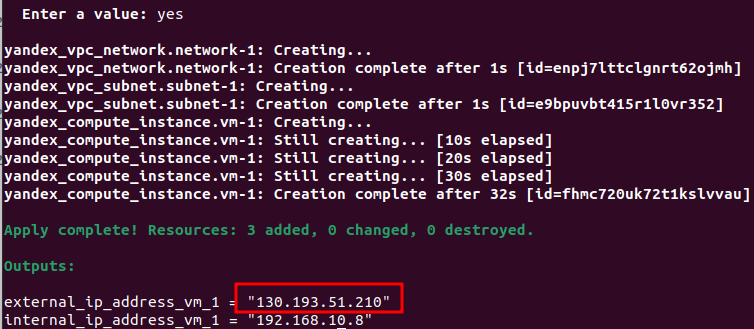
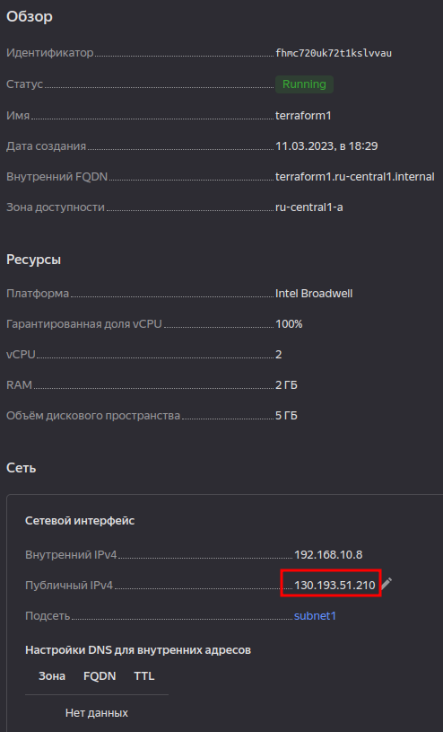
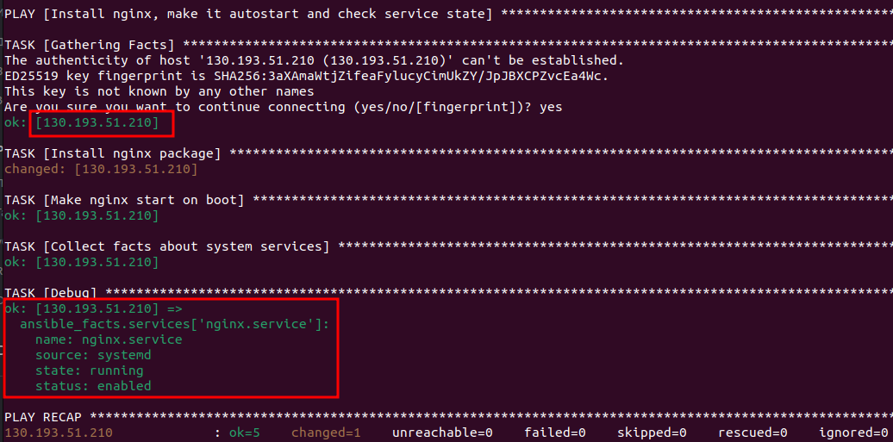

# Домашнее задание к занятию "7.3. Подъём инфраструктуры в Yandex Cloud" - Кулагин Игорь
## Задание 1
> Выполните действия, приложите скриншот скриптов, скриншот выполненного проекта.

[Ссылка на файлы ansible](ansible/)
[Ссылка на файлы terraform](terraform/)
---

---

---

